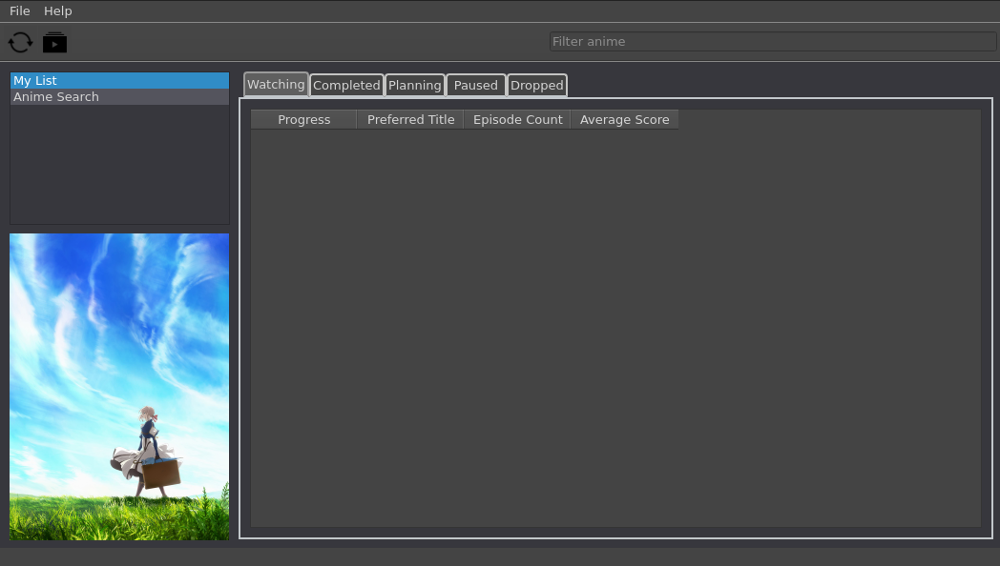
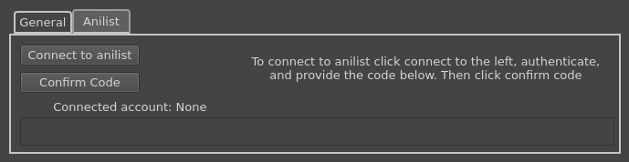
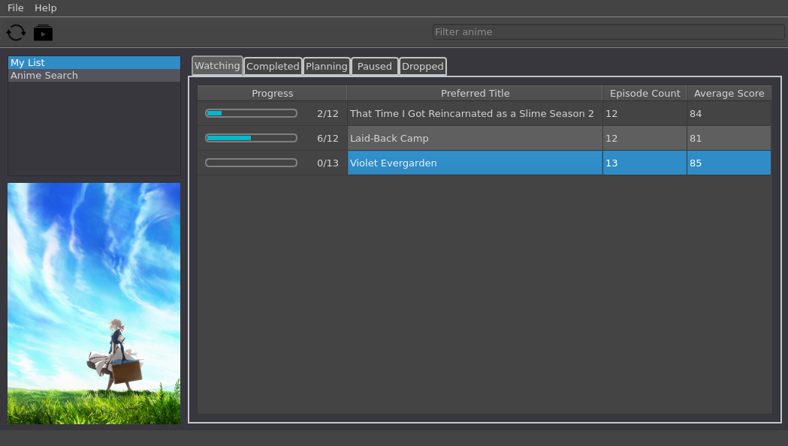
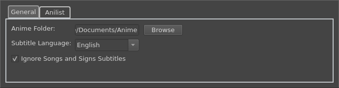
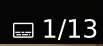
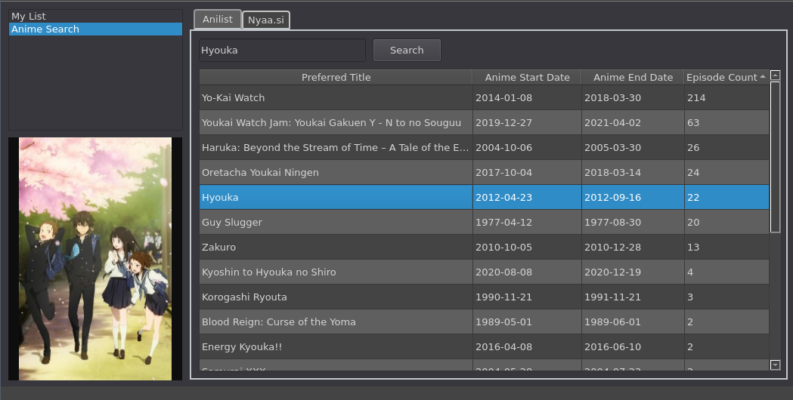

# AniTracker

This tool is designed to help watch, sync, and manage animes with tools such as anilist. As of now, only anilist is supported. However this does support both linux and windows at the moment. Additionally, it comes bundled with a built in, multi-platform, minimal, media player (it adds 2 MB on linux version, but about 50 MB on windows). Due to this you don't have to worry about which media player to set the tool up with, it will automatically work and track how far along you are when the app closes in order to automatically update for you.

Download the latest windows release [here](https://github.com/Phxntxm/AniTracker/releases/latest/download/anitracker.exe)
Download the latest linux release [here](https://github.com/Phxntxm/AniTracker/releases/latest/download/anitracker)

# Tutorial

This is what it will look like when you first open the app. 

It won't show anything, in order to connect to your account click file > settings > anilist

Follow the instructions there and it should load your anime data. The button on the left under the menu will reload data from anilist, the second will reload the files in your anime folder

From here you can modify your list by changing between which table you want to look at/modify. Right clicking will bring up a context menu to swap an anime to watching/planning/etc. Middle clicking will play the next episode based on your current progress. In order to not have false positive accidents, this does not work on already completed animes.

In order to play episodes you will need to connect to your anime folder, that can be done in the settings page. Click file > settings > browse next to Anime Folder

You can also modify your subtitle language here. It is somewhat common to include a subtrack title specifically for songs/signs (for some reason) separate from the normal subtitles. Due to this there's a convenience option to skip any subtitles the app thinks is one of these.

Since this app bundles with a media player tool it can handle subtitles based on your settings in the tracker app itself. The first subtitle track found for the video that matches the language you specify (ignoring songs/signs if this is checked) will be the one chosen. If you want to change subtitles specific to a single file that can be done after you start playing it, with the subtitle button at the bottom

You can search animes by going to the Anime Search page, which will search via anilist. Right clicking one of these results will bring you a menu to modify watching/planning/etc. like in your normal lists. Additionally there's a search nyaa which is a shortcut to clicking the Nyaa.si search and entering the title there.

On the nyaa.si search page it's pretty similar, search for an anime here and double/middle click to open up the selected torrent in your default torrent handler.